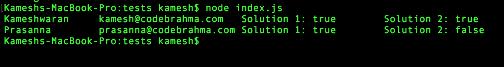

### To Run selenium tests

#### Prerequisites
  1. Download the latest chrome driver from http://chromedriver.storage.googleapis.com/index.html and extract it
  2. Make sure that chromedrive driver can be found on the current PATH.

#### Steps:

Run
  1. `cd tests`
  2. `npm install`
  3. `node index.js`
  4. All done. you should get output similar to the below.
  
